# Terraform DevOps Prueba CI/CD

## Objectivo

Diseñar la infraestructura utilizando Terraform, incluyendo:
▪ VPC para la red.
▪ IAM para los permisos.
▪ S3 para almancenar el codigo del frontend y las versiones terraform.tfstate.
▪ Función lambda para el backend del aplicativo.
▪ CloudFront para el frontend del aplicativo.
▪ Api gateway para la API REST.
▪ Route 53 para enmascarar la url genetica del api gateway y cloudfront a una DNS.

## ARQUITECTURA DE INFRAESTRUCTURA
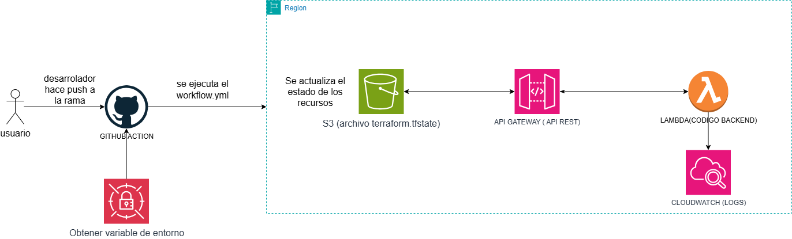
Aqui se puede evidenciar todos los componentes que utilice para poder realizar la prueba,
dentro de la ruta ".github/workglows/gitflow.yml" se encuentra los pasos para desplegar de forma automatizada.
1. Cada vez que se haga un push o pull request a la rama "main", se va ejecutar lo siguiente.
2. Conectarme a AWS mediante un rol que tenga permisos limitados que ciertos accesos para desplegar(buena practica mas seguro que usar las llaves directamente "access_key_id"/"secret_access_key").
NOTA: crear los secretos en el apartado de las configuraciones del repositorio, en la sección de "seguridad" se encuentra los "secretos y variables", hacer clic en "actions".
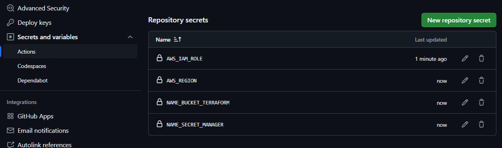
3. Se hace uso de un secreto para poder obtener todos valores de las variables de entorno en los archivos de terraform (buenas practicas es mas seguro y asi te evitas declarar todas dentro del archivo directamente. Ademas si tanto como el codigo del backend y frontend hacen uso de variable de entorno por cada aplicativo se puede tener un secreto con dichas variables de entorno).
NOTA: se recomienda nombrar los secretos con un prefijo como estandar para seguir una nomclatura como esta "terraform/lambda/api-gateway/prueba-fraternitas"
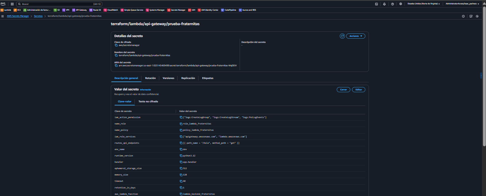
4. Por ultimo; se ejecutan los comandos de terraform, como buena practica se recomienda tener el "terraform.tfstate" en un bucket s3 para poder ir actualizando los recursos para cada despliegue de forma remota.
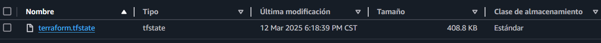
NOTA: Estos son todos los recursos creados para esta solución.
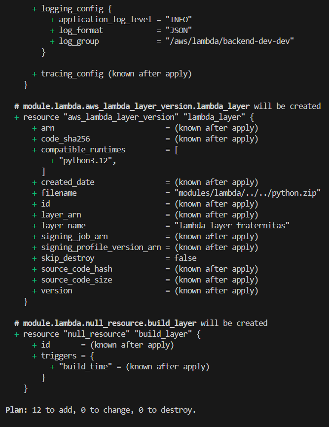
NOTA: Esta es la respuesta a la api desde el postman.
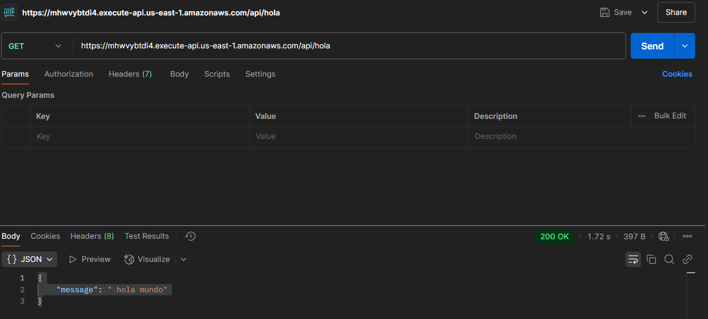

## Indice

- ✅ [VPC](#vpc)
- ✅ [IAM](#iam)
- ✅ [S3](#s3)
- ✅ [LAMBDA](#lambda)
- ✅ [CLOUDFRONT](#cloudfront)
- ✅ [APIGATEWAY](#apigateway)
- ✅ [ROUTE53](#route53)

#### VPC
Es importante tener siempre protegido nuestra infraestructura en una red privada,
mas si se trata de intercomunicarse con una base de datos. 
- primero se define una "VPC" para poder tener un red virtual privada que permite crear una red segura y aislada en la nube.

- Se requiere una "internet gateway" para permitir la salida a internet.
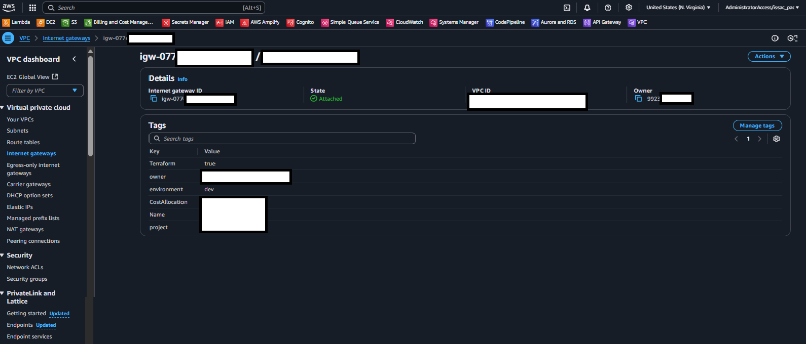
- Tambien se crea subtnet privida y publica. 
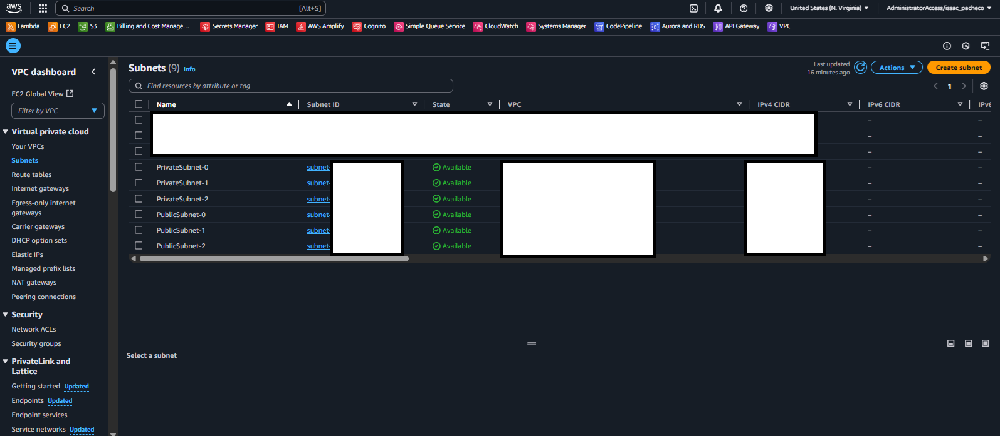
- Se crea "nat gateway" para que la subred privada acceder a Internet sin exponer sus direcciones IP públicas.
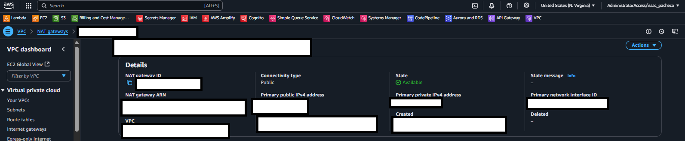
- Es necesario la "route table", para definir las reglas de enrutamiento del tráfico de red entre subredes privada y publica.
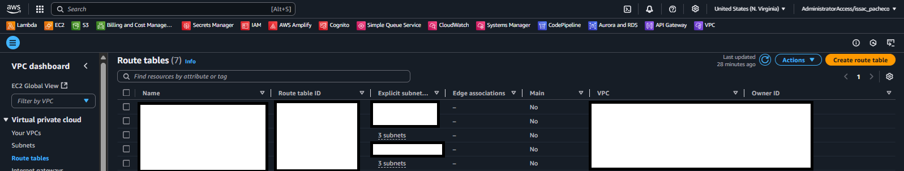
- Por ultimo, pero mas importante el "grupo de seguridad" que actúa como un firewall virtual para controlar el tráfico de red.
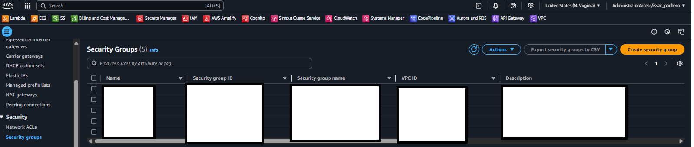

#### IAM
Se necesario tener roles y politicas para poder controlar permisos de ciertos servicios y recuersos dentro de aws.
- Para una funcion lambda se crea una politica con estos basicos de ejecucion.
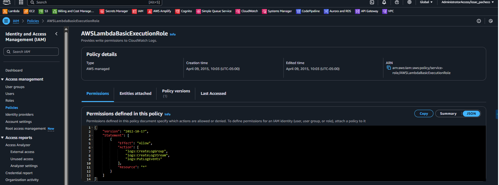
- La politica creada, se atacha al rol con las relaciones de confianza de "lambda" y "api gateway".
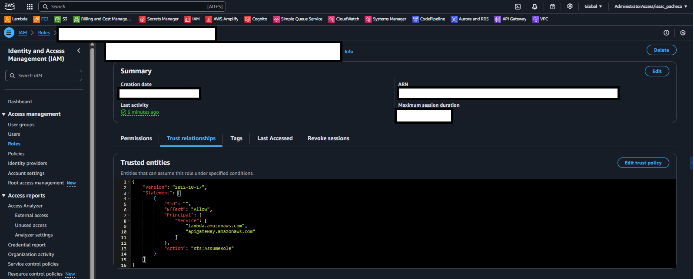

#### S3
Para almacenar el "terraform.tfstate" se necesita lo siguiente.
- Definir el nombre del bucket.
- Activar el versionado de los objetos para tener el historico de los cambios realizados.

- Bloquear el acceso al publico por completo, para garantizar la seguridad de los objetos.
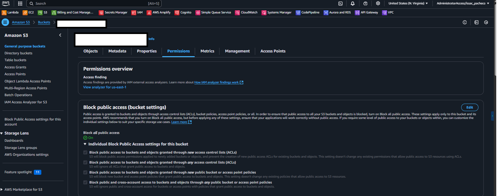

#### LAMBDA
Para poder tener api(backend) segura y cumplicar con las buenas practicas, se tiene lo siguiente.
- Configurar role, handler, runtime, ephemeral_storage_size, memory_size y timeout como variable.
- Crear un grupo de logs para monitorear los eventos.
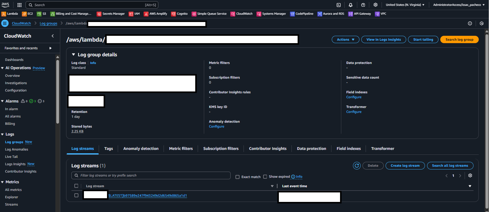
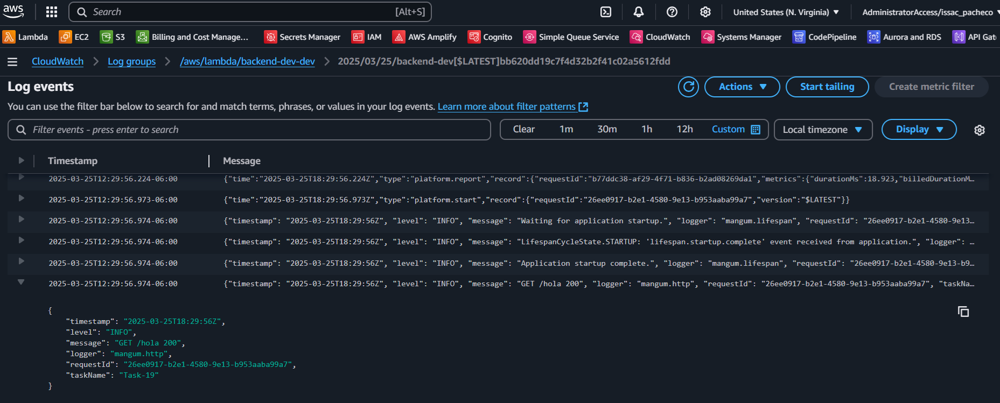
- Como buena practia, se recomienda tener capas en vez de subir todo el codigo junto con las depedencias necesarias,
asi podemos ahorrar espacio de almacenamiento de la lambda y reutizar las misma depedencias en otra función.
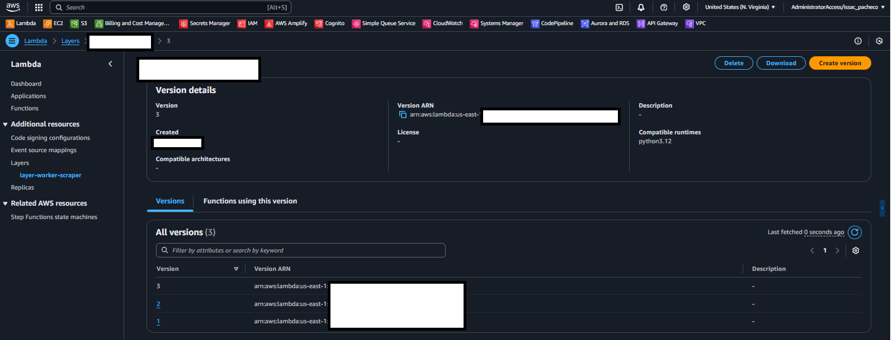

#### APIGATEWAY
Se necesita exponer la lambda que creamos a internet mediante este servicio que aws nos ofrece,
para esto se sigue estos puntos.
- Los endpoints se definen en un secreto para poder tenerlo de forma automatizada, sin tener nada hardcode en el codigo.
ya que si se tiene demasiados paths puede ser una mala practica, por eso como buena practica se recomienda tenerlo de esta forma.
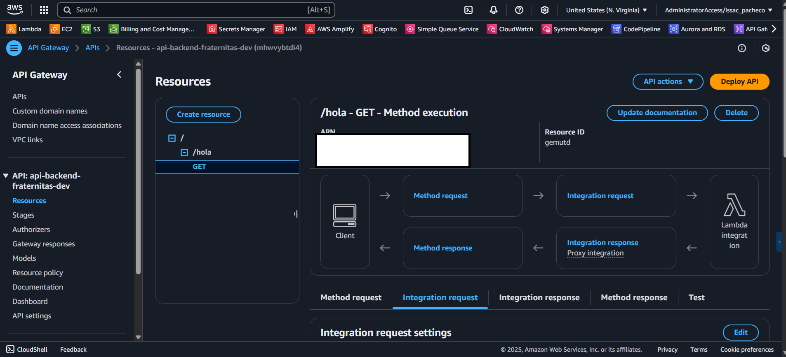
- Como plus, tambien como buena practica tener enmascarado la URL de la api generica a una DNS.
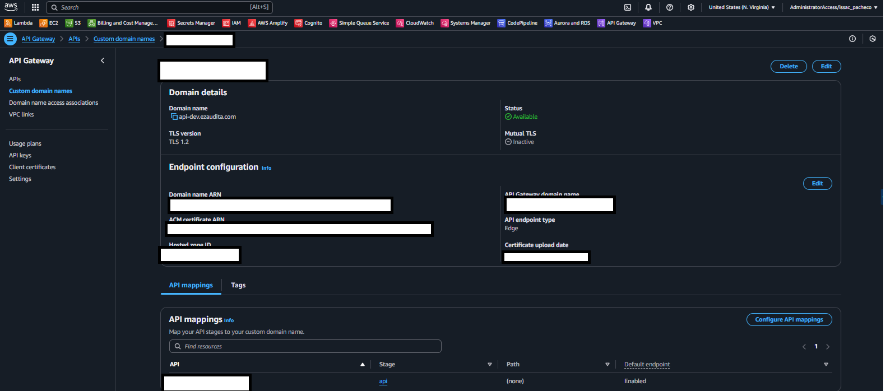

#### CLOUDFRONT
Para poder consumir el micro servicio creado, tener un frontend distribuido y reducir la latencia al usuario final.
Esta cloudfront, pero tambien existen otros servicios como "amplify" para crear, implementar y administrar aplicaciones web y móviles escalables y seguras. Tambient esta "Beanstalk" es ideal para crear, implementar y administrar aplicaciones web escalables y seguras sin necesidad de administrar la infraestructura por debajo 
- Aqui defino algunas configuraciones como el origen del bucket donde se encuentra los objetos html, react u otros como css, etc.
cual sera el index raiz donde redicciona la pagina principal y tambien atachar la url generada por dicho servicio y enmascarada por un dns personalizada.
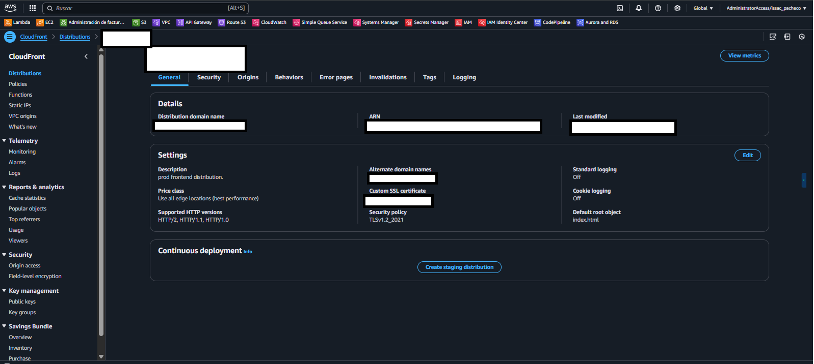

#### ROUTE53
Por ultimo, como buena practica siempre los usuarios deben de consumir ya sea el backend o el frontend via DNS.
- Crear una zona de alojamiento para de la DNS del frotend(cloudfront) y backend(api gateway).
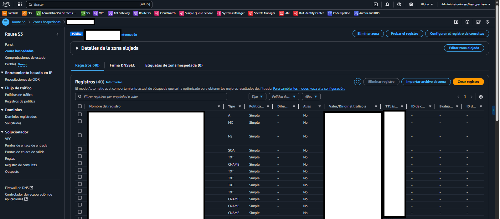