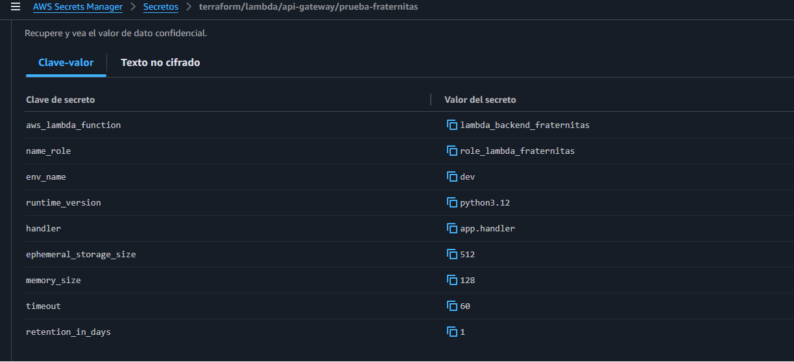
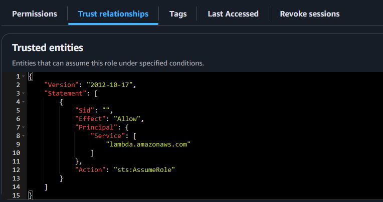

# Terraform DevOps Prueba CI/CD

## Objectivo

Diseñar la infraestructura utilizando Terraform, incluyendo:
▪ IAM para los permisos.
▪ Función lambda para el backend del aplicativo.
▪ Api gateway para la API REST.

## ARQUITECTURA DE INFRAESTRUCTURA

Aqui se puede evidenciar todos los componentes que utilice para poder realizar la prueba,
dentro de la ruta ".github/workglows/gitflow.yml" se encuentra los pasos para desplegar de forma automatizada.
1. Cada vez que se haga un push o pull request a la rama "main", se va ejecutar lo siguiente.
2. Conectarme a AWS mediante un rol que tenga permisos limitados que ciertos accesos para desplegar(buena practica mas seguro que usar las llaves directamente "access_key_id"/"secret_access_key").

NOTA: crear los secretos en el apartado de las configuraciones del repositorio, en la sección de "seguridad" se encuentra los "secretos y variables", hacer clic en "actions".

3. Se hace uso de un secreto para poder obtener todos valores de las variables de entorno en los archivos de terraform (buenas practicas es mas seguro y asi te evitas declarar todas dentro del archivo directamente. Ademas si tanto como el codigo del backend y frontend hacen uso de variable de entorno por cada aplicativo se puede tener un secreto con dichas variables de entorno).
NOTA: se recomienda nombrar los secretos con un prefijo como estandar para seguir una nomclatura como esta "terraform/lambda/api-gateway/prueba-fraternitas"

4. Por ultimo; se ejecutan los comandos de terraform, como buena practica se recomienda tener el "terraform.tfstate" en un bucket s3 para poder ir actualizando los recursos para cada despliegue de forma remota.

## Indice

- ✅ [IAM](#iam)
- ✅ [LAMBDA](#lambda)
- ✅ [APIGATEWAY](#apigateway)

#### IAM
Se necesario tener roles y politicas para poder controlar permisos de ciertos servicios y recuersos dentro de aws.
- Para una funcion lambda se crea una politica con estos basicos de ejecucion.

- La politica creada, se atacha al rol con las relaciones de confianza de "lambda" y "api gateway".

#### LAMBDA
Para poder tener api(backend) segura y cumplicar con las buenas practicas, se tiene lo siguiente.
- Configurar role, handler, runtime, ephemeral_storage_size, memory_size y timeout como variable.
- Crear un grupo de logs para monitorear los eventos.

- Como buena practia, se recomienda tener capas en vez de subir todo el codigo junto con las depedencias necesarias,
asi podemos ahorrar espacio de almacenamiento de la lambda y reutizar las misma depedencias en otra función.

#### APIGATEWAY
Se necesita exponer la lambda que creamos a internet mediante este servicio que aws nos ofrece,
para esto se sigue estos puntos.
- Los endpoints se definen en un secreto para poder tenerlo de forma automatizada, sin tener nada hardcode en el codigo.
ya que si se tiene demasiados paths puede ser una mala practica, por eso como buena practica se recomienda tenerlo de esta forma.
